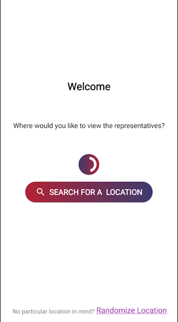
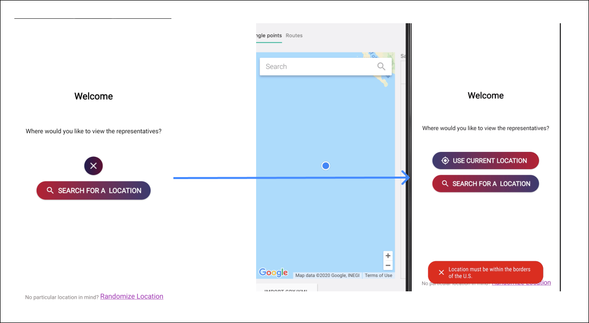
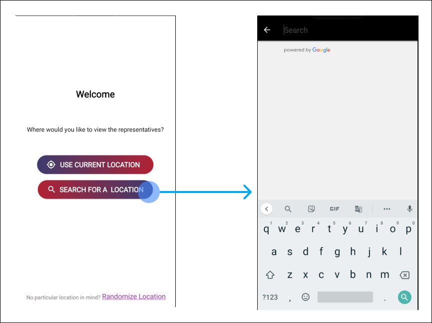
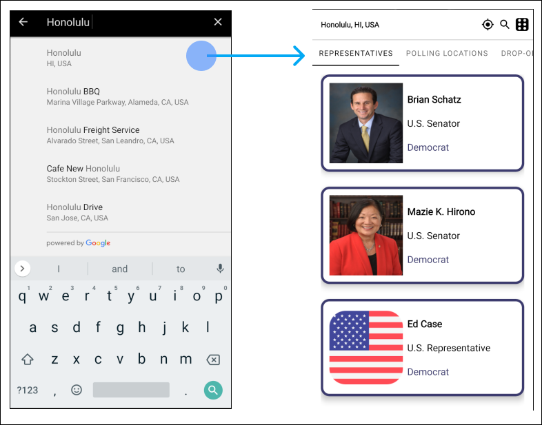
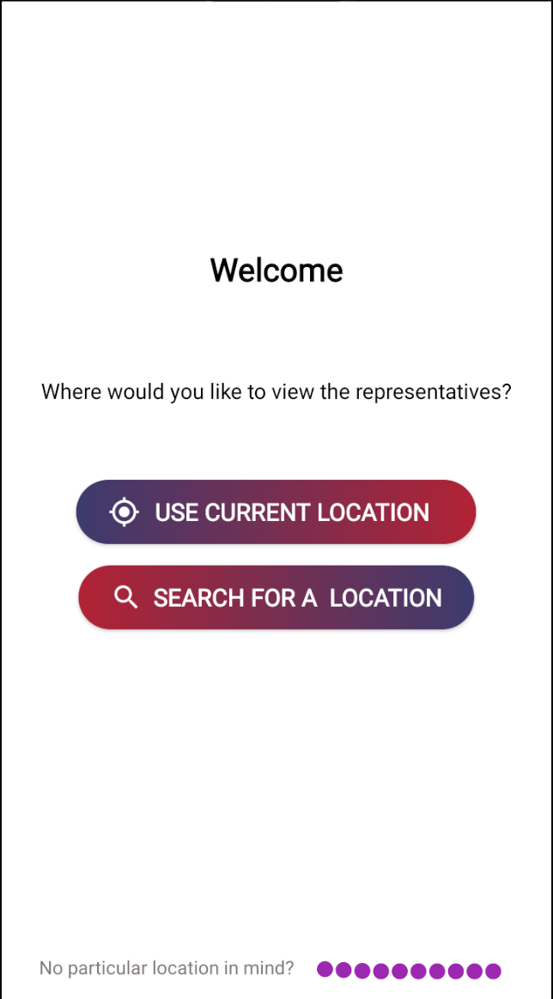
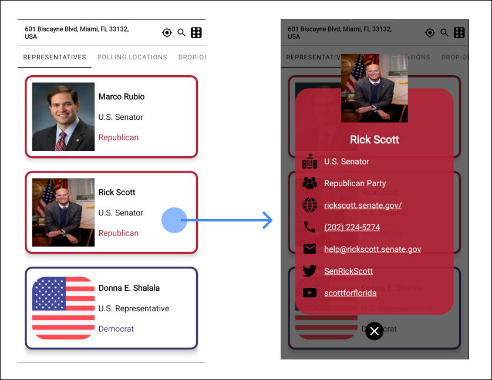
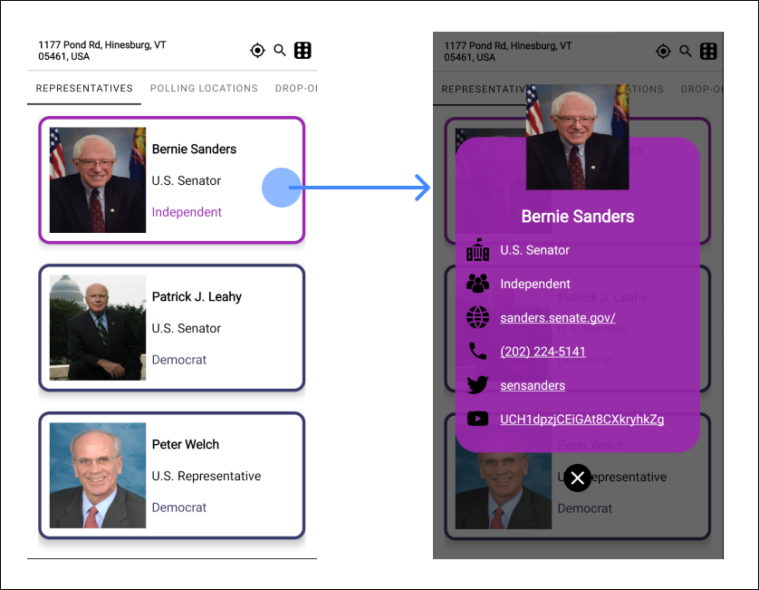
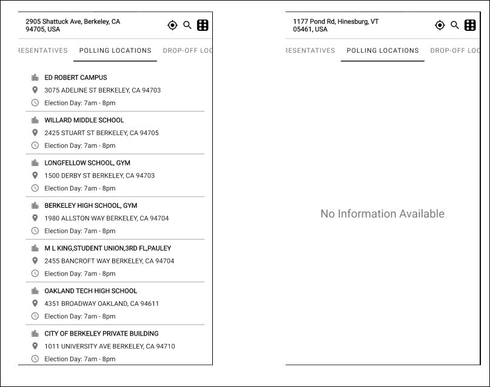
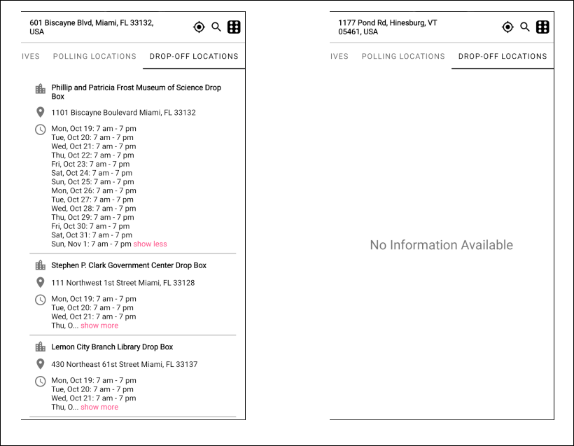

# PROG 02: Represent!

Represent! is an app that uses Google's Places API, GeoCoding API, and CIVIC API to look up U.S. Senators and House Representatives.

### **App Functionality and Requirements**
- App must be able to get the current location correctly on the phone.
- Must correctly look up Senator and House Representative data by location using the address, ZIP code, and GPS
- Must use the APIs to get and display the required data for each congressperson: full name, their party (Democrat, Republican, Independent), website (with link), photo (if available)
- Must implement a random feature for selecting a random location and updating the proper visuals on the phone
- Must make good use of visual elements and an intuitive, easy-to-use interaction flow

### Home Screen

### Requirements

#### Finding Representatives Using the User's Current Location

##### Interaction:
- The user clicks the **USE CURRENT LOCATION** button on the home screen.
- The app responds by asking for the user's permission to get their location. If the user approves, the app will
  begun its search for the user's current location

- If successful, the app will proceed to find the representatives corresponding to the user's current location

- If fail, the app will show a Toast error message instead.

#### Finding Representatives by Searching for a Location

##### Interaction:
- The user clicks the **SEARCH FOR A LOCATION** button on the home screen.
- The app responds by pulling up a location search box.

- The user enters a location and clicks their desired location from the autocomplete search box.
  The app responds by looking up the representatives for the location

#### Finding Representatives using Random U.S. Locations

##### Interaction:
- The user clicks the **Randomize Location** text on the home screen.
- The app responds by finding a random location and getting the representatives corresponding to that location.

#### Representative Detailed View

##### Interaction:
- The user clicks the card view of the representative they want to get more details of.

### Extra Credit

#### Polling Locations

##### Interaction:
- The user uses one of the three ways mentioned above to provide a location input
- The app automatically gets and shows the nearby polling locations(if available)

#### Drop-off Locations

##### Interaction:
- The user uses one of the three ways mentioned above to provide a location input
- The app automatically gets and shows the nearby drop-off locations(if available)

## Author

King Arthur Alagao (kialagao@berkeley.edu)

## Video Link

https://youtu.be/wnlYPG6I1dE

